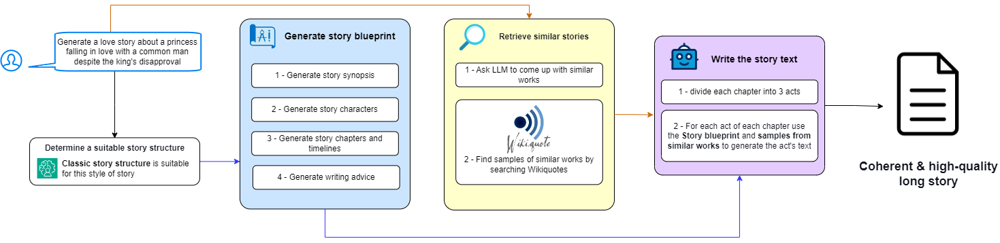

# NovelDreamer
NovelDreamer: Harnessing LLMs for Coherent and Engaging Long-Form Storytelling

[Online demo](https://noveldreamer.streamlit.app/)



## Abstract
Recent advancements in large language models (LLMs) have demonstrated significant potential in text generation, but challenges remain, particularly in crafting long-form narratives that maintain consistency in topic and style, engage readers, and preserve coherence. NovelDreamer addresses these issues through a multifaceted approach. It employs a retrieval-augmented generation (RAG) method, utilizing samples from related works sourced from Wikiquote to enhance stylistic and thematic consistency. To ensure narrative engagement, NovelDreamer integrates established story structures, such as the Hero's Journey and Freytag’s Pyramid, guiding the LLM in crafting compelling and well-structured stories. Additionally, by pre-planning the story into chapters and acts, NovelDreamer facilitates the creation of coherent and captivating long-form narratives. The code for NovelDreamer is publicly available.


## How to Run
- **Firstly**, install the dependencies.
- Update the value of the line to include your own API key:
  ```
  os.environ["OPENAI_API_KEY"] = "Your API key here"
  ```
- Modify the model endpoints and name if desired:
  ```
  model = ChatOpenAI(base_url="https://openrouter.ai/api/v1", model="meta-llama/llama-3.1-8b-instruct:free")
  ```
- Run the script
- If you want to have a GUI, install streamlit, set USE_STREAMLIT value to True and run the following:
  ```
  streamlit run story_generator.py
  ```
